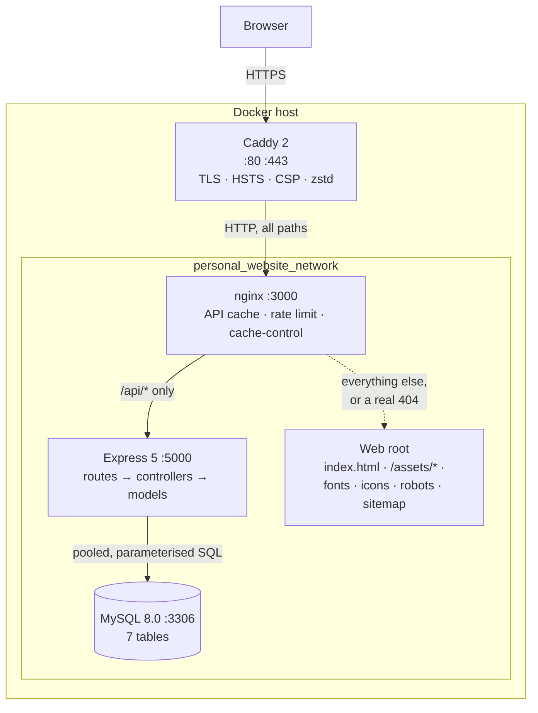

# Architecture

What the moving parts are, and what happens to a request between the browser and MySQL. If you only
want to run the thing, start with [Getting started](getting-started.md).

## The shape of it

One npm workspaces monorepo with three workspaces — `frontend`, `backend`, `e2e` — sharing a single
root `package-lock.json`, plus a `tools/seo` Python package that only runs during an image build.
Nothing is a library; every workspace produces or tests a running artefact.

Only Caddy publishes ports in production. `docker-compose.prod.yml` applies `ports: !reset []` to
MySQL and the backend, so neither is reachable from the host at all — the backend is addressable
only as `backend:5000` on the Docker network, and MySQL only as `mysql:3306`.

## A request, end to end

**In production**, `GET /api/users/1/profile` travels:

1. **Caddy** terminates TLS on a certificate it provisions and renews from Let's Encrypt for the
   domains named in the `Caddyfile`. It applies the `hardening` snippet — HSTS, the CSP,
   `X-Content-Type-Options`, `X-Frame-Options`, `Referrer-Policy`, `Permissions-Policy` — strips
   `Server`, `Via` and `X-Powered-By`, and is the only layer that compresses (`zstd`, `gzip`
   fallback). nginx's own gzip stays off so Caddy can re-encode. It proxies to `frontend:3000`.
2. **nginx** matches `location /api/`. It resolves the real client address from `X-Forwarded-For`
   (`set_real_ip_from 172.18.0.0/16`), applies `limit_req zone=api_limit burst=20 nodelay` against a
   10 requests/second per-address zone, and consults `proxy_cache api_cache` — a 100 MB on-disk cache
   keyed on `$request_uri`, holding 200s for five minutes, with `proxy_cache_lock` so a miss sends
   one upstream request rather than a stampede. Responses carry `X-Cache-Status`. On a miss it
   proxies to `backend:5000`.
3. **Express** runs `helmet()`, then CORS against the comma-separated `ALLOWED_ORIGINS`, then the
   router. `app.set('trust proxy', 1)` makes `req.ip` the real client rather than the nginx
   container. `userRoutes` dispatches to `getUserProfile`, which validates the id through
   `parseId`, then issues six model calls in one `Promise.all` and returns them as a single JSON
   object — `{ user, contactInfo, jobHistory, education, projects, skills, achievements }`. One
   round trip is all the page needs.
4. **Models** hold every SQL statement. Each takes a connection from a `mysql2/promise` pool
   (`connectionLimit: 10`), executes a parameterised query, and releases it in a `finally`. There is
   no ORM and no string-built SQL anywhere.
5. Errors take a different exit. Controllers answer their own 400/404; anything that escapes reaches
   the `errorHandler` middleware, which logs the stack server-side and sends the client a generic
   message from a fixed table — `err.message` never reaches the browser.

Anything that is not `/api/*` is a file. nginx serves `/assets/*` (Vite's content-hashed bundles)
with `max-age=31536000, immutable`, other static files with a week, `index.html` with `no-cache`,
and `robots.txt` and `sitemap.xml` with their correct content types. There is no SPA fallback: the
app has no client-side router, so an unknown path returns a real 404 rather than the shell.

**In development** the chain is two hops shorter. There is no Caddy and no nginx. The `frontend`
service runs the Vite dev server, whose `server.proxy` forwards `/api` to `VITE_API_BACKEND`
(`http://backend:5000` under compose, `http://localhost:5000` outside it). Same-origin either way,
which is why the browser never issues a cross-origin API request.

## The frontend

The client is a single page. `src/index.tsx` mounts `App`, `App` renders the chrome and one
`<main>`, and `ProfilePage` fetches user 1 on mount and renders every section from that one
response.

| Path                        | Holds                                                                                  |
| --------------------------- | -------------------------------------------------------------------------------------- |
| `src/App.tsx`               | Skip link, header (site link, Download CV, EN/GA toggle, theme menu), `<main>`, footer |
| `src/pages/ProfilePage.tsx` | The fetch, the loading skeletons, the error and empty states, the section layout       |
| `src/components/<Name>/`    | One directory per component, each holding `<Name>.tsx` and `<Name>.css`                |
| `src/services/api.ts`       | The whole API client — `getUserProfile` and `getUser`                                  |
| `src/themes/index.ts`       | Five palettes as CSS custom property maps, plus `DEFAULT_THEME_ID`                     |
| `src/hooks/useTheme.ts`     | Reads and writes the `portfolio-theme` localStorage key, applies the palette           |
| `src/i18n/`                 | i18next config and the `en` and `ga` locale files                                      |
| `src/utils/date.ts`         | Month/year formatting                                                                  |
| `src/types/index.ts`        | The interfaces the API response is read as                                             |

Four things are worth knowing before you change any of it:

- **The API client is native `fetch`.** `getJson` sets `Content-Type` and `X-Requested-With`, sends
  `credentials: 'omit'`, aborts after ten seconds via `AbortSignal.timeout`, and throws on a non-2xx
  status because `fetch` resolves for those. There is no HTTP library dependency.
- **Themes are inline custom properties, not stylesheets.** `useTheme` writes each palette's
  variables onto `document.documentElement.style` and sets `color-scheme`, so native controls match.
  Components only ever reference `var(--color-…)`.
- **Fonts are self-hosted.** `frontend/public/fonts/fonts.css` declares Cormorant Garamond and
  DM Sans as variable woff2 files served from the same origin. No request leaves for Google Fonts —
  which is also why the CSP can hold `font-src 'self'`.
- **Dates format in UTC.** The API serialises MySQL `DATE` columns as midnight UTC, which is the
  previous day in any negative offset. `formatDate` pins `timeZone: 'UTC'`, and carries its own Irish
  month names because Chromium ships no `ga` date data while Node's full-ICU build does.

## The frontend image has three stages

`frontend/Dockerfile` builds in three stages, and which one you get depends on the compose target.

| Stage        | Base               | Does                                                                                       |
| ------------ | ------------------ | ------------------------------------------------------------------------------------------ |
| `builder`    | `node:24-alpine`   | `npm ci --workspace=frontend`, then `npm run build -w frontend` → `/app/frontend/build`    |
| `seo`        | `python:3.13-slim` | Installs `tools/seo/requirements.txt`, runs `generate_seo.py` over the build directory     |
| `production` | `nginx:alpine`     | Copies the SEO stage's web root to `/usr/share/nginx/html` and `nginx.conf` into `conf.d/` |

`docker-compose.yml` sets `target: builder` and overrides the command with `npm run dev`, so
development stops at the first stage and never runs Python. `docker-compose.prod.yml` sets
`target: production`, which pulls the whole chain.

The `seo` stage takes two inputs the repository does not carry: `SITE_URL`, passed as a build arg
from the root `.env`, and `database/prod-initdb.d/500_prod_seed.sql`, which is gitignored. From
those it rewrites the head of the built `index.html` — title, description, canonical, Open Graph,
Twitter card, schema.org JSON-LD — and writes `robots.txt`, `sitemap.xml` and a 1200×630
`og-image.png` beside it. If either input is missing or still a template placeholder it writes
nothing and exits 0, so a build without deployment data still succeeds. [SEO](seo.md) has the
detail.

The backend image is simpler: a `builder` stage that compiles TypeScript, and a `production` stage
that reinstalls with `--omit=dev` and copies in only `dist/`.

## Where configuration comes from

Five sources, each owning a different moment.

| Source                     | Read by                       | At              | Tracked                                      |
| -------------------------- | ----------------------------- | --------------- | -------------------------------------------- |
| Root `.env`                | `docker compose`              | Container start | No (`.env.example`, `.env.prod.example` are) |
| `backend/.env`             | `dotenv` in `src/index.ts`    | Backend start   | No (`backend/.env.example` is)               |
| `frontend/.env.production` | Vite, inlined into the bundle | Frontend build  | No (`.env.production.example` is)            |
| `SITE_URL` build arg       | The `seo` image stage         | Frontend build  | Passed from the root `.env`                  |
| `Caddyfile`                | The Caddy container           | Caddy start     | No (`Caddyfile.example` is)                  |

Compose passes environment into the containers directly, so `backend/.env` matters only when you run
the backend outside Docker. Anything `VITE_`-prefixed is a **build-time** value baked into the
bundle, not a runtime one — changing `VITE_APP_URL` needs a rebuild, not a restart.

The `Caddyfile` and `docker-compose.host.yml` are deliberately gitignored: they are deployment state
bind-mounted into running containers, and a `git pull` that overwrote them would break live TLS on
the next restart. Their `.example` templates are tracked.
[Configuration](configuration.md) lists every variable; [Deployment](deployment.md) covers setting
them up on a host.

## The database

MySQL 8.0, seven tables, all owned by `users` through `userId` (or `user_id` on `contact_info`)
foreign keys with `ON DELETE CASCADE`. Schema comes from `database/migrations/001`–`009`, which the
MySQL image runs from `/docker-entrypoint-initdb.d` the first time its volume is created — there is
no migration runner and no migration state table. `createdAt` and `updatedAt` are database-managed.

`contact_info` is the one place the column names differ from the API: it uses snake_case
(`user_id`, `display_order`), and `ContactInfoModel` aliases them to `userId` and `displayOrder` in
the `SELECT` so TypeScript sees one convention throughout.

[Database](database.md) covers migrations and seeds; [`database/SCHEMA.md`](../database/SCHEMA.md)
has the column-level definitions.
